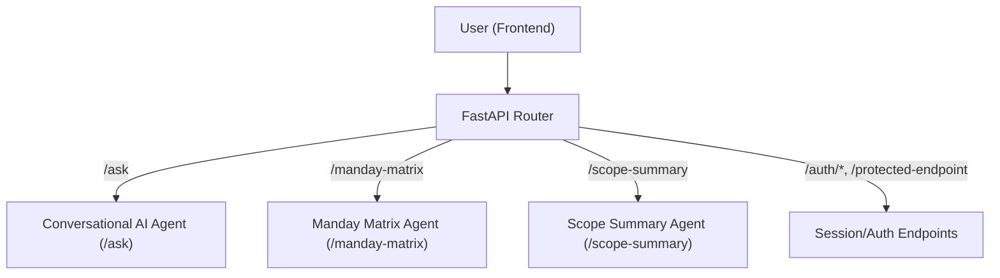

# ADR-01: Agent Routing

## Status
Accepted

## Context
The iRead Customer AI Chat Platform is a full-stack application with a React (Vite) frontend and a FastAPI backend. The backend is designed to handle multiple types of user requests, such as conversational AI chat, manday estimation, and scope summary generation. Each of these features is implemented as a separate logical "Agent" in the backend. Agent Routing refers to the mechanism by which incoming requests are dispatched to the appropriate agent (endpoint/function) for processing.

## Decision
- The FastAPI backend exposes multiple endpoints, each corresponding to a specific agent:
    - `/ask` for Conversational AI (requirement gathering)
    - `/manday-matrix` for Manday Matrix (estimation)
    - `/scope-summary` for Scope Summary (project scope export)
- The frontend (React) sends requests to these endpoints based on user actions and UI context.
- Session management and authentication are handled via JWT tokens stored in httpOnly cookies, with session validation on protected endpoints (e.g., `/protected-endpoint`).
- The routing logic is currently rule-based, determined by the API endpoint path. Each endpoint is responsible for invoking the correct business logic (agent) in the backend.
- The architecture is designed to be extensible: new agents can be added as new endpoints and integrated into the router.

## Consequences
- The system is modular and easy to extend with new agents/endpoints.
- Each agent is isolated in its own endpoint, making maintenance and testing easier.
- The frontend does not need to know the internal logic of each agent, only the API contract.
- Security and session management are centralized via JWT and cookie-based authentication.
- The current routing is rule-based; future improvements could include intent-based or AI-driven routing if needed.

## Example
- When a user interacts with the chat, the frontend sends messages to `/ask`, which is handled by the Conversational AI agent.
- When a user requests a manday estimation, the frontend sends data to `/manday-matrix`, which is handled by the Manday Matrix agent.
- When a user wants to export a scope summary, the frontend interacts with `/scope-summary`.
- Session validation is performed by calling `/protected-endpoint`, which checks the JWT in the cookie.

## Diagram

## Alternatives Considered
- Letting the frontend call each agent as a microservice (adds complexity, not needed at this stage).
- Using a single endpoint with intent classification to route requests (more flexible, but unnecessary for current requirements).

## References
- [ADR Template](https://adr.github.io/)
- [FastAPI Docs](https://fastapi.tiangolo.com/)
- [React Docs](https://react.dev/)

